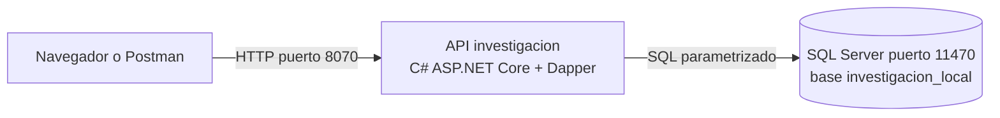
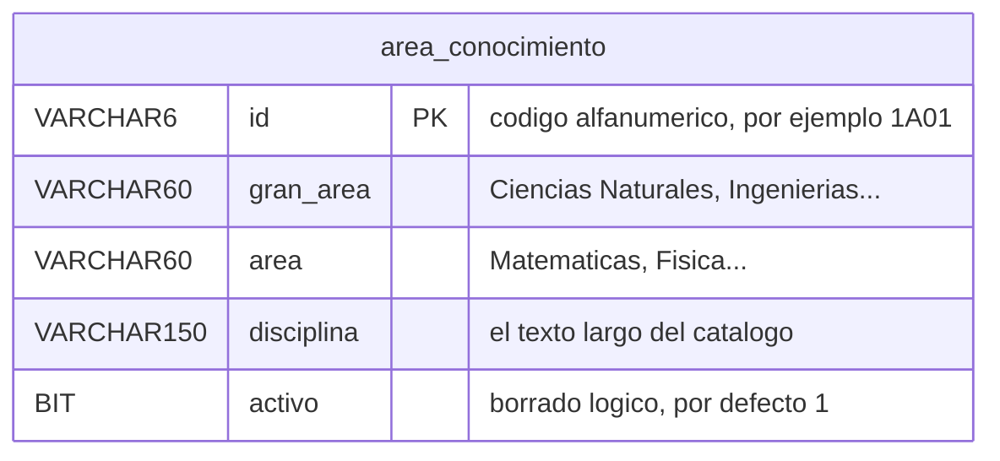
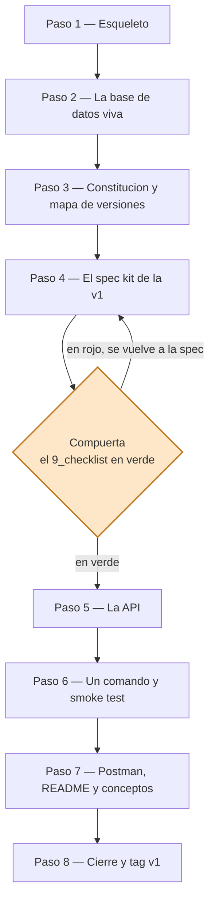
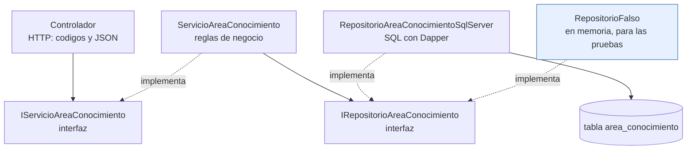
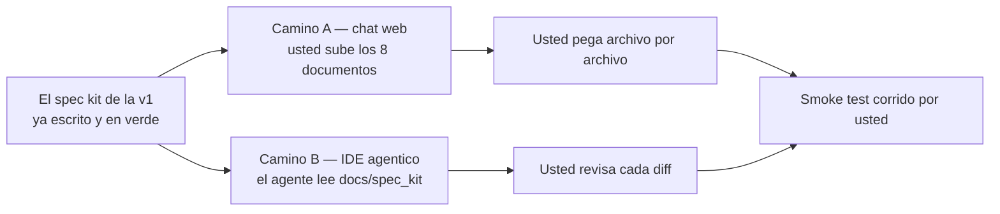

# Plan — construir la v1 del módulo Investigación con la plantilla del curso

> **Qué es este documento.** El plan de trabajo para producir, en este
> repositorio, el **ejemplo de referencia** del módulo Investigación: su
> versión 1 funcionando, con su spec kit completo — usando como molde
> [`proyecto_aplicacion_y_servicios_web1`](https://github.com/ccastro2050/proyecto_aplicacion_y_servicios_web1).
>
> **Nada de esto se ha ejecutado todavía.** Aquí solo está el plan, para
> revisarlo y aprobarlo antes de tocar un archivo.

---

## 0. Lo que queda al terminar



Un solo comando lo levanta todo, y el CRUD completo de una tabla responde
en el navegador con su documentación interactiva.

## 1. Los insumos

| Insumo | Qué aporta |
|---|---|
| `ProyectosDeAula/docs/modulo_investigacion.md` | El **QUÉ**: las 19 tablas, la ruta de 4 versiones, qué entra en cada una |
| `ProyectosDeAula/db_scripts/sqlserver/investigacion.ss.sql` | El **DDL**: 223 líneas, 19 `CREATE TABLE`, 19 claves foráneas |
| `ProyectosDeAula/Mapa_conocimiento/…/Base de Datos v6.xlsx` | Los **datos de referencia** de los catálogos |
| `proyecto_aplicacion_y_servicios_web1` | El **molde de método**: estructura, spec kit, guía de IA, documentos conceptuales |
| `…web2`, `…web3` y `…web4` | Cómo crece el molde: cada uno agrega **una versión** con su propia carpeta de spec kit, sin tocar las anteriores |
| `ProyectosDeAula/docs/0_METODOLOGIA.md` | Las reglas del juego: SDD por versiones, las tres compuertas, la rúbrica |

## 2. Lo que encontré al revisar los insumos

Verificado contra el `.sql` y el Excel, no es opinión:

| # | Hallazgo | Consecuencia |
|---|---|---|
| 1 | `area_conocimiento.id` está declarado `INT`, pero los datos del Excel son códigos alfanuméricos (`1A01`, `6E03`) | El script **no puede cargar sus propios datos**. Arrastra a `ac_linea.area_conocimiento`, que lo referencia |
| 2 | `area_conocimiento.disciplina` es `VARCHAR(60)`; el valor más largo del Excel tiene **124** caracteres | Desborda |
| 3 | `area_aplicacion.nombre` es `VARCHAR(60)`; su valor más largo tiene **129** | Desborda |
| 4 | Ninguna de las 16 tablas del módulo tiene columna `activo` (solo `rol` y `usuario`) | La metodología y la rúbrica exigen **borrado lógico con inactivos filtrados** |
| 5 | El `.sql` no trae **ni un `INSERT`** | Sin semillas no hay smoke test verificable, que es la definición de "terminada" |
| 6 | `termino_clave` y `linea_investigacion` están **vacías** en el Excel | Dos de las seis tablas de la v1 arrancan sin datos |
| 7 | Los ODS traen **cuatro** categorías (`Social`, `Económicos`, `Ambientales`, `Estrategicos`) | El documento del módulo dice tres (Social/Económica/Ambiental) |

Los conteos que **sí** cuadran con el documento del módulo: `area_conocimiento` 218 · ODS 17 · `area_aplicacion` 21 · `universidad` 6.

> Los hallazgos 1 a 4, 6 y 7 no son estorbos: son **material didáctico**.
> Son ambigüedades y defectos reales que se resuelven en la **compuerta 1**
> y quedan registrados como Clarificaciones en `2_spec.md`, con su razón.
> Es exactamente lo que el método pide: cuando la realidad no cuadra con
> el documento, se para, se decide y se deja escrito — no se improvisa
> dentro del código.

## 3. Decisiones que hay que tomar antes de empezar

| # | Decisión | Recomendación |
|---|---|---|
| A | ¿Se corrigen los cuatro defectos del `.sql` (tipos, tamaños y `activo`)? | **Sí.** Sin las tres primeras la BD no carga su Excel; sin `activo` la v1 contradice su propia rúbrica. Cada corrección queda documentada en la cabecera del script y como Clarificación |
| B | Alcance de la v1 | **Una sola tabla sin clave foránea: la que más campos tiene.** Ver la sección 3.1 |
| C | Dónde vive el ejemplo | **En la raíz de este repositorio**, con la misma forma que `aplicacion_y_servicios_web1`. `ProyectosDeAula/` se queda intacta: los estudiantes ya la conocen |
| D | Stack | El mismo del molde: **C# / ASP.NET Core 10 + Dapper + SQL Server**, sin ORM y con el SQL a la vista |

### 3.1 Por qué la v1 es UNA tabla, y por qué esa

El ejemplo del curso construye su v1 sobre **una sola tabla** (`producto`)
y con eso enseña todo: las capas, las interfaces, los cinco verbos, los
códigos de error y la prueba sin base de datos. Aquí se hace igual, por la
misma razón didáctica: **una rebanada vertical completa enseña más que seis
CRUD repetidos**, y el patrón que queda es el que los equipos replican
para las demás tablas.

La tabla se escoge con dos reglas: **sin clave foránea** (para no arrastrar
integridad referencial a la v1, que es tema de la v2) y **la de más
campos** (para que el CRUD tenga sustancia). Las candidatas:

| Tabla sin FK | Campos | Filas de semilla |
|---|---|---|
| **`area_conocimiento`** | **4** — `id`, `gran_area`, `area`, `disciplina` | **218** |
| `universidad` | 4 — `id`, `nombre`, `tipo`, `ciudad` | 6 |
| `linea_investigacion` | 3 | 0 |
| `objetivo_desarrollo_sostenible` | 3 | 17 |
| `area_aplicacion` | 2 | 21 |
| `termino_clave` | 2 | 0 |

Hay **empate en 4 campos** entre `area_conocimiento` y `universidad`. Se
toma **`area_conocimiento`** por tres razones:

1. **Sus 218 filas dan un smoke test de verdad.** Listar, limitar con
   `?limite=3`, buscar uno que existe y uno que no: con 6 filas eso se
   siente de juguete.
2. **Su llave primaria es un código de texto** (`1A01`), igual que el
   `codigo` de `producto` en el ejemplo del curso — no un entero
   autonumérico. Se conserva la enseñanza del molde.
3. **Es la que trae los defectos** de los hallazgos 1, 2 y 4. Eso convierte
   la compuerta 1 en algo real y no en un ejercicio de relleno.

La tabla que se construye en la v1, con las correcciones ya aplicadas:



> **Ojo con una diferencia respecto a `modulo_investigacion.md`:** ese
> documento define la v1 de los EQUIPOS como las 6 tablas sin FK. Este
> ejemplo toma una sola **a propósito**, porque su trabajo es enseñar el
> método, no cubrir el módulo. Las otras cinco entran en la v2 del ejemplo,
> que es justamente donde se ve cómo se crece sin romper lo anterior.

## 4. Los puertos

Este proyecto usa un **bloque de puertos propio**, verificado libre para que
pueda correr **al mismo tiempo** que los ejemplos del curso (`web1` … `web4`)
sin pelearse con ninguno:

| Servicio | Puerto | Desde |
|---|---|---|
| API investigación | **8070** | v1 |
| SQL Server | **11470** | v1 |
| Front | **8071** | reservado para la v4 |

Quedan escritos en el artículo de convenciones de la constitución —incluido
el del front, que todavía no existe— para que ninguna versión futura los pise.

> **La regla, y aplica también a los equipos:** dos proyectos que puedan
> estar encendidos a la vez **nunca** publican el mismo puerto del host. Si
> su proyecto de aula levanta la API en el mismo puerto que el ejemplo del
> curso, el segundo que arranque falla — y el error no se parece en nada a
> un choque de puertos, así que se pierden horas buscando donde no es.

## 5. El plan, en 8 pasos



**Nada de código antes de la compuerta.** Ese es el orden del método, y es
lo que se evalúa.

### Paso 1 — Esqueleto: primero las carpetas, después los archivos

Todo desde la **terminal integrada de VS Code** (*Terminal → New Terminal*,
PowerShell), parado en la raíz del proyecto.

**Las carpetas no son manía de orden: SON la arquitectura.** Por eso se
crean antes de escribir nada — la estructura queda decidida antes de
programar, que es justo lo que evita el "después lo acomodo". Esto es lo
que debe quedar:

```
proyecto_investigacion1/
├── db/                                 ← el script y su inicializador (artefacto DADO)
├── api_investigacion/
│   ├── Controllers/                    ← CAPA 1: HTTP — códigos de estado y JSON
│   ├── Peticiones/                     ← la frontera de entrada: valida el cuerpo → 422
│   ├── Modelos/                        ← la entidad, lo que viaja entre capas
│   ├── Servicios/                      ← CAPA 2: negocio — no conoce HTTP ni el motor
│   ├── Repositorios/                   ← CAPA 3: datos — el SQL con Dapper
│   ├── Excepciones/                    ← cómo el negocio avisa un 404 sin hablar de HTTP
│   └── pruebas/                        ← el servicio con un repositorio FALSO, SIN base de datos
├── docs/
│   └── spec_kit/
│       ├── 1_constitution.md           ← permanente: rige TODAS las versiones
│       └── versiones/
│           ├── 0_mapa_versiones.md     ← la ruta v1 → v4
│           └── v1_area_conocimiento/   ← 2_spec … 8_tasks · 9_checklist · GUIA_IA1
├── postman/                            ← la colección para probar con clics
├── docker-compose.yml                  ← TODO el sistema declarado en un archivo
├── README.md
└── ProyectosDeAula/                    ← el material del curso: NO se toca
```

Las tres capas, en detalle, y las carpetas que se confunden con ellas:

| Carpeta | Qué va adentro | Papel |
|---|---|---|
| `api_investigacion\Controllers` | Los endpoints | **Capa 1 — HTTP**: traduce a códigos de estado y JSON |
| `api_investigacion\Peticiones` | Una clase por verbo (crear, reemplazo, actualizar) | La **frontera de entrada**: lo que valida el cuerpo y produce los 422 |
| `api_investigacion\Modelos` | La entidad `AreaConocimiento` | Lo que viaja entre capas |
| `api_investigacion\Servicios` | La interfaz y las reglas de negocio | **Capa 2 — negocio**: no conoce HTTP ni el motor |
| `api_investigacion\Repositorios` | La interfaz y el SQL con Dapper | **Capa 3 — datos**: no conoce HTTP |
| `api_investigacion\Excepciones` | `NoEncontradoExcepcion` | Cómo el negocio avisa un 404 sin hablar de HTTP |
| `api_investigacion\pruebas` | La prueba de capas | Corre el servicio con un repositorio FALSO, **sin base de datos** |
| `db` | El script y su inicializador | Artefacto **dado**: se copia, no se especifica |
| `docs\spec_kit` | La constitución y las versiones | La fuente de verdad del proyecto |
| `postman` | La colección | Probar los endpoints con clics |

Primero el esqueleto de carpetas, con la misma forma que el molde:

```powershell
mkdir db, postman,
      api_investigacion\Controllers, api_investigacion\Modelos,
      api_investigacion\Peticiones, api_investigacion\Servicios,
      api_investigacion\Repositorios, api_investigacion\Excepciones,
      api_investigacion\pruebas,
      docs\spec_kit\versiones\v1_area_conocimiento
```

Y ahora los **archivos vacíos**, que se irán llenando en los pasos
siguientes. Crearlos de una vez tiene una ventaja concreta: el árbol
completo queda a la vista en VS Code desde el minuto uno, y nadie inventa
rutas nuevas a mitad de camino.

```powershell
# raíz del proyecto
#   (.gitignore y .gitattributes YA EXISTEN en este repositorio: no se
#    vuelven a crear, se editan cuando toque)
New-Item -ItemType File docker-compose.yml, README.md

# la base de datos (paso 2)
New-Item -ItemType File db\investigacion.sql, db\init.sh

# la API (paso 5)
New-Item -ItemType File `
  api_investigacion\ApiInvestigacion.csproj, api_investigacion\Dockerfile,
  api_investigacion\Program.cs, api_investigacion\appsettings.json,
  api_investigacion\Modelos\AreaConocimiento.cs,
  api_investigacion\Peticiones\AreaConocimientoCrear.cs,
  api_investigacion\Peticiones\AreaConocimientoReemplazo.cs,
  api_investigacion\Peticiones\AreaConocimientoActualizar.cs,
  api_investigacion\Repositorios\IRepositorioAreaConocimiento.cs,
  api_investigacion\Repositorios\RepositorioAreaConocimientoSqlServer.cs,
  api_investigacion\Servicios\IServicioAreaConocimiento.cs,
  api_investigacion\Servicios\ServicioAreaConocimiento.cs,
  api_investigacion\Controllers\AreaConocimientoController.cs,
  api_investigacion\Excepciones\NoEncontradoExcepcion.cs,
  api_investigacion\pruebas\PruebaCapas.csproj,
  api_investigacion\pruebas\Programa.cs

# el spec kit (pasos 3 y 4)
New-Item -ItemType File `
  docs\spec_kit\1_constitution.md,
  docs\spec_kit\versiones\0_mapa_versiones.md,
  docs\spec_kit\versiones\v1_area_conocimiento\2_spec.md,
  docs\spec_kit\versiones\v1_area_conocimiento\3_plan.md,
  docs\spec_kit\versiones\v1_area_conocimiento\4_research.md,
  docs\spec_kit\versiones\v1_area_conocimiento\5_data_model.md,
  docs\spec_kit\versiones\v1_area_conocimiento\6_contracts.md,
  docs\spec_kit\versiones\v1_area_conocimiento\7_quickstart.md,
  docs\spec_kit\versiones\v1_area_conocimiento\8_tasks.md,
  docs\spec_kit\versiones\v1_area_conocimiento\9_checklist.md,
  docs\spec_kit\versiones\v1_area_conocimiento\GUIA_IA1.md

# la colección de pruebas (paso 7)
New-Item -ItemType File postman\coleccion_v1.postman_collection.json
```

> **Dos detalles de PowerShell que ahorran un rato:** el acento grave
> (`` ` ``) al final de una línea significa "el comando sigue abajo"; y
> `-ItemType File` es obligatorio — sin él, PowerShell se queda preguntando
> qué tipo de elemento quiere crear.

#### Los dos archivos que ya existen, y por qué hay que ajustarlos

`.gitignore` y `.gitattributes` ya están en el repositorio, pero con el
contenido que servía cuando aquí solo vivía el material del curso. Para un
proyecto .NET que corre en contenedores **se quedan cortos**, y las dos
cosas que les faltan son de las que hacen perder una tarde entera.

**`.gitattributes` — cómo guarda Git los finales de línea.** Windows
termina cada renglón con dos caracteres (CR LF) y Linux con uno (LF). Da
igual… hasta que un archivo escrito en Windows se ejecuta dentro de un
contenedor Linux. Este proyecto tiene exactamente ese caso:
**`db/init.sh`**, el inicializador de SQL Server. Si Git lo entrega con
finales de Windows, el contenedor responde:

```
/bin/bash^M: bad interpreter: No such file or directory
```

Un error que no se parece en nada a su causa, y que manda al estudiante a
buscar el problema en Docker o en el script. La línea que lo previene:

```gitattributes
# Normalizar finales de línea: en el repositorio siempre LF
* text=auto

# Los scripts de bash DEBEN ir con LF (corren dentro de contenedores Linux)
*.sh text eol=lf

# La documentación también, para que los diff no se llenen de ruido
*.md text eol=lf
```

**`.gitignore` — lo que NUNCA entra al repositorio.** Tres familias:

```gitignore
# 1. Compilados de .NET: los genera 'dotnet build', jamás se versionan
bin/
obj/

# 2. Basura de IDE y borradores personales
*.user
.vs/
*.session.sql
Thumbs.db

# 3. SECRETOS: el archivo de variables de entorno nunca se sube
.env

# Lo que ya estaba: los originales del profesor no se publican
ProyectosDeAula/docs/_originales_no_subir/
```

> **Sobre el `.env`, y esto hay que decirlo en voz alta:** este ejemplo
> lleva la contraseña de la base de datos **escrita en el
> `docker-compose.yml`**, igual que los repositorios del curso, y eso es
> **solo por didáctica** — para que un `git clone` y un comando basten. A
> los equipos el método les exige lo contrario: cadena de conexión y
> `JWT_SECRET` por variables de entorno, `.env` en el `.gitignore` y un
> `.env.example` en el repositorio. **Esa parte del ejemplo no se copia.**

**Verificación:** deben quedar **14 carpetas** y **32 archivos nuevos** en
0 bytes, más los dos archivos de configuración actualizados. `git status`
los debe listar a todos. Si algún archivo nuevo trae contenido, se ejecutó
de más.

### Paso 2 — La base de datos viva
`db/investigacion.sql` = el DDL dado **+ las cuatro correcciones + `activo`** en las 16 tablas del módulo **+ las semillas extraídas del Excel** (218 · 17 · 21 · 6). Cada corrección documentada en la cabecera del propio script. Más `db/init.sh` (el inicializador de SQL Server, que el motor no ejecuta solo) y el `docker-compose.yml` con los tres servicios.
```powershell
docker compose up -d          # levanta SQL Server y corre el inicializador

# ¿quedaron las 19 tablas y los datos?
docker compose exec sqlserver /opt/mssql-tools18/bin/sqlcmd `
  -S localhost -U sa -P "Paradigmas123!" -C -d investigacion_local `
  -Q "SELECT 'area_conocimiento' t, COUNT(*) n FROM area_conocimiento
      UNION ALL SELECT 'ODS', COUNT(*) FROM objetivo_desarrollo_sostenible
      UNION ALL SELECT 'area_aplicacion', COUNT(*) FROM area_aplicacion
      UNION ALL SELECT 'universidad', COUNT(*) FROM universidad"
```

**Verificación:** ese comando debe responder **218 · 17 · 21 · 6**. Si un
número no cuadra, el paso no está terminado.

> Va **antes** de la spec a propósito: en este método `db/` es un
> **artefacto dado** (se copia, no se especifica), y la spec necesita los
> conteos exactos para escribir el smoke test.
>
> La base de datos se crea **completa, con sus 19 tablas**, aunque la v1
> solo toque una. Es la misma regla del ejemplo del curso: la BD es
> infraestructura dada, y lo que crece por versiones es la API. Lo que la
> spec sí prohíbe es que el código de la v1 **nombre** cualquier otra
> tabla.

### Paso 3 — Constitución y mapa de versiones
`docs/spec_kit/1_constitution.md` del módulo (stack, capas con interfaces, español, borrado lógico, un solo comando, puertos) y `versiones/0_mapa_versiones.md` con las 4 versiones que ya define `modulo_investigacion.md`.
**Verificación:** cada artículo se puede citar para zanjar una discusión sin abrir el código.

### Paso 4 — El spec kit de la v1, ANTES de una línea de código
En `docs/spec_kit/versiones/v1_area_conocimiento/`: los documentos `2_spec` a `8_tasks`, el `9_checklist.md` y la `GUIA_IA1.md`. Con las tres compuertas puestas:

- **Clarificaciones** en `2_spec.md`: los hallazgos **1, 2 y 4** de la sección 2, que son los que tocan a `area_conocimiento`, cada uno con su pregunta, su respuesta y su razón. No hay ninguna inventada. Los hallazgos 3, 6 y 7 quedan anotados para las versiones que usen esas tablas.
- **Chequeo de constitución** en `3_plan.md`, artículo por artículo.
- **`9_checklist.md`** para firmar antes de programar.

**Verificación:** el checklist pasa en verde. **Este es el paso que hay que revisar antes de seguir** — es la regla del propio método.

### Paso 5 — La API
C# / ASP.NET Core + Dapper, capas con interfaces, para `area_conocimiento`: el modelo, las tres peticiones (crear / reemplazo / actualizar), la interfaz y el repositorio, la interfaz y el servicio, y el controlador con los siete endpoints. Más `Program.cs` con el ensamblador, `Dockerfile` y el proyecto `pruebas/` con un repositorio falso en memoria. **Unos 12 archivos**, no 45: esa es la ganancia de haber escogido una sola tabla.


Las flechas son las **únicas** dependencias permitidas. Y fíjese en el
repositorio falso: como el servicio solo conoce la interfaz, se le puede
enchufar uno de mentiras y probarlo **sin base de datos**. Eso es lo que
demuestra que las capas están de verdad desacopladas.

```powershell
dotnet build api_investigacion
dotnet run --project api_investigacion\pruebas
```

**Verificación:** compila, y la prueba de capas corre **sin** base de datos.

### Paso 6 — Un solo comando y smoke test real
```powershell
docker compose up -d --build

curl http://localhost:8070/                                  # diagnostico: version v1
curl http://localhost:8070/api/area_conocimiento             # total: 218
curl "http://localhost:8070/api/area_conocimiento?limite=3"  # exactamente 3
curl http://localhost:8070/api/area_conocimiento/1A01        # una fila
curl -i http://localhost:8070/api/area_conocimiento/9Z99     # 404 con mensaje claro
```

Y la pareja que enseña la diferencia entre los dos verbos de actualización:
un `PUT` sin uno de los campos responde **422**, y el **mismo** cuerpo
enviado por `PATCH` responde **200**.

**Verificación:** los criterios de aceptación en verde, con la salida real
pegada — no de palabra.

### Paso 7 — Material de apoyo
Colección de Postman, `README.md` con el arranque en un comando, y los documentos conceptuales del curso adaptados (mismo stack: solo cambian nombres y puertos).

### Paso 8 — Cierre
`9_checklist.md` firmado, commit, **tag `v1`** y push.

```powershell
git add -A
git commit -m "v1: CRUD de area_conocimiento con capas e interfaces"
git tag v1
git push origin main --tags
```

**Verificación:** el tag `v1` aparece en GitHub y el repositorio clonado en
limpio levanta con un solo comando.

## 6. El prompt para construir la v1

El paso 5 no se hace a pulso: se construye con IA, **siguiendo la spec**.
Hay dos caminos y el prompt cambia según cuál se use. En ambos vale la
misma regla: la IA propone, usted verifica.



### 6.1 Camino A — chat web (Gemini, DeepSeek, ChatGPT…)

Se le suben **8 documentos**: `1_constitution.md` y los siete de
`v1_area_conocimiento/` (`2_spec` a `8_tasks`). El `9_checklist.md` **no**
se sube: es la lista con la que usted revisó la spec, no material para la
IA. Y `db/investigacion.sql` tampoco: ya está hecho y se copia tal cual.

```text
Actúa como mi asistente de programación para construir la VERSIÓN 1 de un
proyecto universitario, partiendo de cero. Te adjunto 8 documentos: una
constitución (reglas permanentes) y el spec kit de la versión 1 (spec,
plan, research con las decisiones, modelo de datos, contratos, quickstart
y tareas).

El proyecto es C# sobre ASP.NET Core (.NET 10) + SQL Server, con Dapper y
el SQL escrito a mano — así lo fija 3_plan.md. Si en tu respuesta aparece
OTRO lenguaje o framework, significa que no leíste los adjuntos: detente y
dímelo en vez de continuar.

REGLAS DE TRABAJO (no negociables):

1. La especificación manda. No agregues NADA que los documentos no pidan:
   ni paquetes extra, ni Entity Framework, ni tablas de más, ni "mejoras"
   de tu cosecha. Si crees que falta algo, o si un documento admite dos
   lecturas, PREGÚNTAME antes: no lo resuelvas por tu cuenta ni "asumas"
   nada. Yo anotaré la respuesta en la sección de Clarificaciones de mi
   2_spec.md.
2. Vamos a seguir 8_tasks.md FASE POR FASE, en orden. En cada fase:
   a. Me explicas en 3-5 líneas qué vamos a hacer y por qué.
   b. Me entregas los archivos DE A UNO: primero la ruta exacta y el
      contenido COMPLETO de UN solo archivo, con los comentarios
      didácticos en español que exige la constitución. Esperas mi "listo"
      y solo entonces me das el siguiente.
   c. Al cerrar la fase me dices su comando de verificación y qué salida
      esperar.
   NOTA: la estructura de carpetas y los archivos vacíos YA EXISTEN en mi
   proyecto — no me des comandos para crearlos; tu trabajo es dictarme el
   CONTENIDO de cada archivo.
3. La base de datos YA VIENE DADA en db/investigacion.sql: la tabla
   area_conocimiento existe, tiene 218 filas y su llave primaria es un
   CÓDIGO DE TEXTO (por ejemplo '1A01'), no un entero. No escribas ni
   modifiques SQL de creación de tablas.
4. El borrado es LÓGICO: DELETE marca activo = 0, y los listados filtran
   los inactivos. Nunca se borra la fila.
5. El código debe cumplir 6_contracts.md al pie de la letra: mismos
   verbos, mismas rutas, mismos códigos de estado y formatos de respuesta,
   incluido el contraste PUT (reemplazo completo → 422 si falta un campo)
   vs PATCH (parcial → 200 con el mismo cuerpo).
6. Todo en español: nombres, comentarios y mensajes.
7. Trabajo en Windows con VS Code (terminal integrada de PowerShell) y
   Docker Desktop. Dame los comandos para ese entorno. La API publica el
   puerto 8070 y SQL Server el 11470.

Al final, la versión 1 está TERMINADA solo cuando pasan los criterios de
aceptación de 2_spec.md, verificados con el smoke test de 7_quickstart.md.

Empieza: resume en máximo 10 líneas qué vamos a construir (para confirmar
que entendiste el alcance) y luego arranca con la Fase 0.
```

### 6.2 Camino B — IDE agéntico (Antigravity, Cursor, Claude Code…)

Aquí no se sube nada: el agente **lee la carpeta**. El prompt es más corto
porque el contexto ya está en el disco.

```text
Construye la VERSIÓN 1 de este proyecto.

Primero lee, en este orden, los documentos que están bajo docs/spec_kit/
(1_constitution.md en la raíz; los demás en versiones/v1_area_conocimiento/):
1_constitution, 2_spec, 3_plan, 4_research, 5_data_model, 6_contracts,
7_quickstart y 8_tasks. Después resume en máximo 10 líneas qué vas a
construir y espera mi confirmación antes de tocar nada.

El código va en api_investigacion/ según la estructura de 3_plan.md.
docs/ y db/ son SOLO LECTURA: no los modifiques. La base de datos ya viene
dada en db/investigacion.sql.

REGLAS (no negociables):

1. La especificación manda. No agregues nada que los documentos no pidan.
   Si crees que falta algo, o si un documento admite dos lecturas,
   PREGÚNTAME antes: no lo resuelvas por tu cuenta ni "asumas" nada. Yo
   anotaré la respuesta en la sección de Clarificaciones de 2_spec.md.
2. Sigue 8_tasks.md fase por fase. Al terminar cada fase EJECUTA su
   verificación, muéstrame la salida real, y espera mi OK antes de seguir.
3. El borrado es LÓGICO (activo = 0) y los listados filtran inactivos.
4. Cumple 6_contracts.md al pie de la letra, incluido PUT=422 vs
   PATCH=200 con el mismo cuerpo.
5. Todo en español, C# sobre ASP.NET Core (.NET 10) con Dapper y el SQL a
   la vista. API en el puerto 8070, SQL Server en el 11470.
6. Al final, corre el smoke test completo de 7_quickstart.md y muéstrame
   la evidencia de cada criterio de aceptación. La versión no está
   terminada hasta que todos estén en verde.
```

> **Lo que hay que vigilar, en los dos caminos.** Cuando la IA diga "asumo
> que…" o "por defecto voy a…", **párela**. Eso no es un detalle de
> implementación: es una ambigüedad de la especificación disfrazada. Se
> decide, y la respuesta se escribe en las Clarificaciones de `2_spec.md`
> — no solo en el chat. El chat se cierra; la spec queda.

## 7. Qué se copia, qué se adapta y qué se escribe de cero

Si de todo este plan hay que quedarse con una sola tabla, es esta:

| Se copia tal cual | Se adapta | Se escribe de cero |
|---|---|---|
| La estructura de carpetas · `9_checklist.md` · la `GUIA_IA1.md` · los documentos conceptuales · `.gitignore` | `1_constitution.md` (stack y convenciones) · `0_mapa_versiones.md` (las 4 versiones del módulo) · `docker-compose.yml` (nombres y puertos) | `2_spec` … `8_tasks` de la v1 · `db/investigacion.sql` · toda la API |

**El mensaje:** del repositorio del curso se replica el **método**, no el
contenido. La carpeta `api_facturas/` es lo de menos; lo que se copia es
`docs/`.

## 8. Riesgos

- **El paso 5 es el largo** (~45 archivos). Conviene revisar el paso 4 antes, porque un error en la spec se multiplica por seis tablas.
- **Las semillas pueden traer sorpresas** además de las ya detectadas (tildes, filas fantasma). Los conteos se verifican contra el documento del módulo y **cualquier diferencia se reporta, no se acomoda**.
- **Los secretos**: este ejemplo llevará la contraseña quemada, como los repos del curso. El módulo exige `.env` a los equipos, así que la constitución del ejemplo debe decir explícitamente que **esa parte no se copia**.

## 9. Estado

Nada ejecutado. A la espera del visto bueno sobre las decisiones A, B, C y D
de la sección 3.
