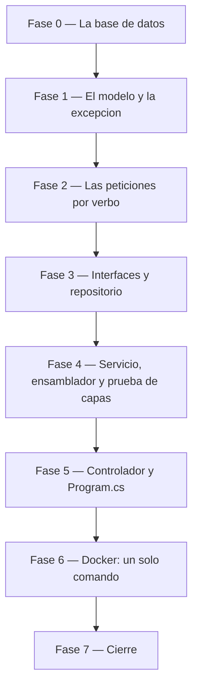

# Tareas — Versión 1: `area_conocimiento`

> El orden de construcción, en fases. Cada fase termina en una
> **compuerta**: un comando concreto que se corre y se mira. No se avanza
> con una fase en rojo.
>
> `[P]` marca las tareas que **no dependen entre sí** y pueden repartirse.
> En una construcción por capas la mayoría son secuenciales, y está bien.

## Fase 0 — La base de datos (artefacto dado)

- [ ] `db/investigacion.sql`: el DDL con las cuatro correcciones, la
      columna `activo` y las semillas del Excel
- [ ] `db/init.sh`: crear la base y ejecutar el script, una sola vez
- [ ] `docker-compose.yml`: los servicios `sqlserver` y `sqlserver-init`

**Verificar:** `docker compose up -d sqlserver sqlserver-init` y un
`SELECT COUNT(*)` que responda **218 · 17 · 21 · 6**.

## Fase 1 — El modelo y la excepción · *sirve a todos los RF*

- [ ] `Modelos/AreaConocimiento.cs` — la entidad: `Id`, `GranArea`, `Area`,
      `Disciplina`. **Sin `Activo`**: no viaja en las respuestas
- [ ] `[P]` `Excepciones/NoEncontradoExcepcion.cs`
- [ ] `ApiInvestigacion.csproj` con los tres paquetes permitidos
- [ ] `[P]` `appsettings.json` — la cadena de conexión de desarrollo, para
      poder correr sin Docker. **El compose la sobreescribe** con la
      variable de entorno ([3_plan](3_plan.md) §5)

**Verificar:** `dotnet build api_investigacion` compila.

## Fase 2 — Las peticiones por verbo · *RF3, RF4, RF5*

- [ ] `[P]` `Peticiones/AreaConocimientoCrear.cs` — los 4 campos, todos
      `[Required]`; `Id` con `[MaxLength(6)]`
- [ ] `[P]` `Peticiones/AreaConocimientoReemplazo.cs` — los 3 del cuerpo,
      obligatorios
- [ ] `[P]` `Peticiones/AreaConocimientoActualizar.cs` — los 3, todos
      opcionales

Las tres son independientes: se pueden repartir.

**Verificar:** compila. La diferencia entre la segunda y la tercera es lo
que producirá el 422 del `PUT` y el 200 del `PATCH`.

## Fase 3 — Interfaces y repositorio · *RF1, RF2, RF6*

- [ ] `Repositorios/IRepositorioAreaConocimiento.cs` — los siete métodos
- [ ] `Servicios/IServicioAreaConocimiento.cs`
- [ ] `Repositorios/RepositorioAreaConocimientoSqlServer.cs` — el SQL con
      Dapper, **siempre parametrizado**, con `WHERE activo = 1` en todo
      listado y el `UPDATE … SET activo = 0` del borrado

**Verificar:** compila, y una lectura del código confirma que **ninguna**
consulta concatena valores y que **ningún** listado olvida el `activo = 1`.

## Fase 4 — Servicio, ensamblador y prueba de capas · *criterio 7*

- [ ] `Servicios/ServicioAreaConocimiento.cs` — reglas de negocio; lanza
      `NoEncontradoExcepcion` cuando el repositorio no devuelve nada
- [ ] `pruebas/PruebaCapas.csproj` y `pruebas/Programa.cs` — un
      **repositorio de mentiras** (otra implementación de
      `IRepositorioAreaConocimiento`, con una lista en memoria) y las
      verificaciones del servicio contra él ([3_plan](3_plan.md) §4.6)

**Verificar:** `dotnet run --project api_investigacion/pruebas` pasa
**sin SQL Server encendido**. Si exige la base, las capas no están
desacopladas.

## Fase 5 — Controlador y ensamblado · *todos los RF*

- [ ] `Controllers/AreaConocimientoController.cs` — los 7 endpoints, con
      la traducción de excepciones a códigos HTTP
- [ ] `Program.cs` — Swagger, y las dos líneas del ensamblador

**Verificar:** `dotnet run` y `curl http://localhost:8070/` responde el
diagnóstico con `"version":"v1"`.

## Fase 6 — Docker: un solo comando · *criterio 1*

- [ ] `api_investigacion/Dockerfile` — imagen SDK con `dotnet watch`
- [ ] `docker-compose.yml` — el servicio `api-investigacion`, con la cadena
      de conexión por variable de entorno

**Verificar:** `docker compose down -v` y luego
`docker compose up -d --build` deja **todo** funcionando desde cero.

## Fase 7 — Cierre

- [ ] Correr el smoke test completo de [7_quickstart.md](7_quickstart.md)
- [ ] Pasar y **firmar** [9_checklist.md](9_checklist.md)
- [ ] `postman/coleccion_v1.postman_collection.json` y el `README.md`
- [ ] Commit y **tag `v1`**

**Verificar:** los 7 criterios de aceptación en verde, con la salida real
pegada. Sin eso no hay tag.
